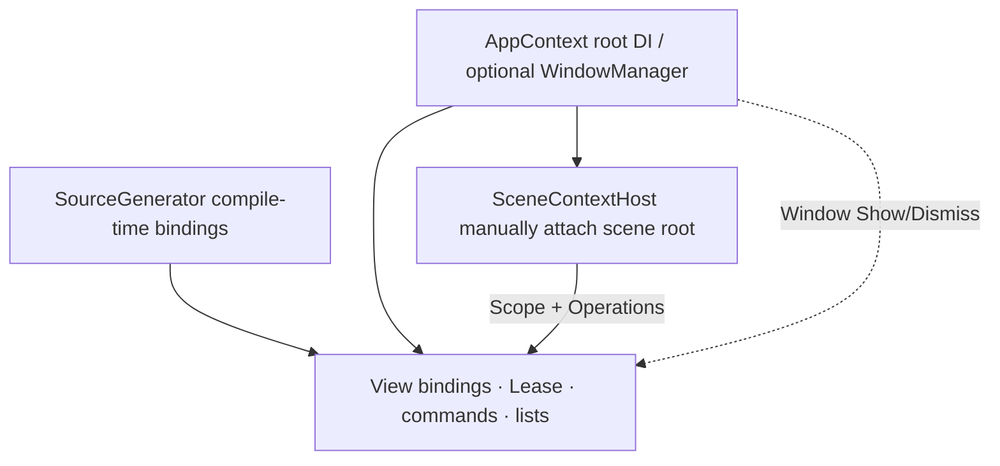
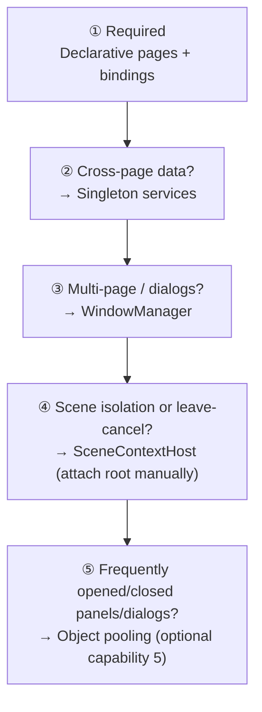

# DotPudica Framework - A MVVM Framework for Godot .NET

<div align="center">


</div>

        [](https://github.com/Cholopol/dot-pudica-framework/stargazers) [](https://github.com/Cholopol/dot-pudica-framework/network/members)

[English](README.md) | [简体中文](README_CN.md)

DotPudica is an MVVM framework for **Godot 4.7 + .NET 8**. It brings traditional .NET data binding to Godot’s node-based UI: the View owns controls and presentation; the ViewModel owns state, commands, and flow. Bindings are generated at compile time and are AOT-friendly. It focuses on cross-platform, UI-heavy apps and games.

| Repo entry                       | Purpose                                              |
| -------------------------------- | ---------------------------------------------------- |
| `addons/dot-pudica`              | **This is all a game project needs** (plugin deliverable) |
| `DotPudicaFramework` / `samples` | This repo’s host project + Showcase demos            |
| `tests` / `benchmarks`           | This repo’s CI / evidence — **do not copy into a game project** |
| `.github`                        | CI and Release packaging                             |

### Quick start

This repository is the **full source tree** (samples, tests, benchmarks). When building a game, **do not** copy the entire repo into your project.

1. Download `dot-pudica-*.zip` from [Releases](https://github.com/Cholopol/dot-pudica-framework/releases), or copy only `addons/dot-pudica/` from this repo.
2. Unpack / place it under your Godot project root so the path is `addons/dot-pudica/`.
3. Follow [Quick usage](#quick-usage-minimal-runnable-setup) below to enable the plugin and complete Bootstrap — **do not** reference or copy `tests/`, `benchmarks/`, or `samples/`.

Release notes and how Releases relate to Issues/PRs: see [CONTRIBUTING.md](CONTRIBUTING.md#版本与发版).

### AI assistant skills

The plugin ships a set of **skills for AI coding assistants** under `addons/dot-pudica/Skills/` (SKILL.md format), teaching assistants how to use the framework correctly:

- **Capability skills** — each framework domain (project setup, pages & bindings, DI/scene Scope, windows, pooling, messaging & threading, validation) has clear input/output contracts and acceptance checkpoints.
- **Routing skill** (`dotpudica-route`) — decides which skill a task should invoke and the correct call order (bootstrap first, validation last).
- **Workflow skills** — end-to-end recipes (new project setup, add a page, dialogs, shared data, scene Scope, pooling optimization, fixing DOTPUDICA diagnostics).

How to use: point the agent at `addons/dot-pudica/Skills/` and ask it to read `dotpudica-route/SKILL.md` first; or copy that folder into the agent’s skills directory (e.g. `$env:USERPROFILE\.config\opencode\skills\`). Skills cover only the plugin’s public API.

***

## Design philosophy

Q1: Why use MVVM in Godot?

Q2: How does it differ from traditional Godot style?

Q3: How does it compare to desktop MVVM frameworks (WPF, Avalonia, etc.)?

For framework usage examples, jump to “[Quick usage](#quick-usage-minimal-runnable-setup)”.

### 1. Why use MVVM in Godot

Godot’s native UI model is “node tree + script + signals”: the UI is built from nodes, logic lives in node scripts, and nodes talk via signals. That model is very direct for small UIs, but as a project grows — menus, inventory, online matchmaking, and so on — two problems become increasingly painful:

- **State sync is handwritten.** The same data (player gold, room state, match progress) often drives many controls. The traditional approach is to walk nodes and assign values by hand on every change. Once state is mutated in multiple places, updating one spot and forgetting to refresh another is almost inevitable.
- **Logic and presentation are coupled on nodes.** Logic is scattered across scripts and tightly tied to the scene tree. Unit-testing a login or matchmaking flow means building scenes, attaching nodes, and faking signals — the test cost dwarfs the logic itself.

In MVVM, **the ViewModel holds state and flow; the View only maps them to the UI — clear roles and clear layers**.

This framework’s Core layer does not reference Godot at all. ViewModels are ordinary .NET classes — you can unit-test them without the engine. The View wires VM properties and commands to controls via bindings; state changes are pushed to the UI by the binding engine, so you no longer refresh by hand. View and ViewModel can be developed in parallel, with high maintainability and throughput. The three pillars of MVVM — data binding, declarative UI, and data flow — are all present in DotPudica.

| Benefit              | Notes                                                                 |
| -------------------- | --------------------------------------------------------------------- |
| Single source of truth | The UI always shows the VM’s current state; no easy-to-desync copies |
| Testable             | Logic leaves the scene tree; pure C# unit tests, no Godot             |
| Reusable             | The same VM can drive different Views (layout, skin, entry point)     |
| Leak risk contained  | Subscriptions and lifetime are managed by the framework; `[Subscribe]` auto-unsubscribes |

**For simple control UIs and demos, the native style is faster** — an extra abstraction always has a cost. When UI state grows, you need cross-page shared data, or you need data-driven UI updates, MVVM’s payoff starts to scale. That is why this framework layers capabilities on demand: the minimum setup is declarative pages + bindings; windows, Scope, and shared services are added only when needed.

### 2. Differences from traditional Godot style

| Scenario           | Traditional Godot                                      | DotPudica                                                      |
| ------------------ | ------------------------------------------------------ | -------------------------------------------------------------- |
| Data → UI          | Hand-wired signals; refresh controls one by one on change | Property bindings; VM property changes push to controls automatically |
| UI → data          | Control signal → script reads/writes; code scattered   | Command bindings / `TwoWay` bindings; direction declared in one place |
| Where logic lives  | Mixed with nodes in the same script; tied to the scene tree | ViewModel is a pure C# class; no Godot reference               |
| State sync         | Handwritten in many places; easy to miss one           | Binding engine syncs uniformly; no desyncable copies           |
| Lifecycle          | Hand-wire `_Ready`/`_ExitTree`, unsubscribe manually   | `[DotPudicaView]` declarative lifecycle; subscriptions auto attach/detach |
| Dependency injection | None, or hand-rolled global singletons               | `AppContext` root DI + `SceneContextHost` scene-level Scope    |
| When errors show up | Runtime (wrong path, misspelled signal name)          | Compile-time diagnostics (DOTPUDICA series); bad binding paths fail the build |
| UI construction    | Scene editor + code                                    | Unchanged — bindings are an additive layer; they do not replace the Godot editor workflow |

**Pros**: single source of truth for state, logic unit-testable, clear ownership for cross-page shared data, binding errors at compile time, page switches without leaks.

**Cost**: one more abstraction layer — a few more declarations than wiring signals directly at first; binding relations live in C# attributes, not `.tscn`, so the scene editor does not show “who binds whom” and you must read the View source; payoff is small for tiny UIs.

### 3. Comparison with modern MVVM frameworks such as Avalonia

If you know Avalonia, WPF, or similar .NET MVVM frameworks, most DotPudica concepts map over; a few deliberate differences each have a reason. The current Alpha went through four design attempts — for example splitting UI units for hot-pluggable systems and better memory management, or introducing a Controller to centralize and reuse business logic — and every one was eventually abandoned, settling into today’s shape. That may also reflect the author’s limits of experience; history suggests good designs converge. If you have better ideas, talk to us.

**Similarities:**

- **Three-layer MVVM separation**: View / ViewModel / Model roles match desktop MVVM — ViewModel is a pure .NET class with no UI dependency; Model remains ordinary .NET types organized by the business side (see “no prescribed Model layer” below);
- **Same property-notification toolkit**: CommunityToolkit.Mvvm’s `[ObservableProperty]` / `[RelayCommand]`, same as Avalonia’s official templates;
- `BindingMode` **semantics match**: `OneWay` / `TwoWay` / `OneWayToSource` / `OneTime`; default mode is also inferred from the control — input controls default to `TwoWay`, display controls to `OneWay`;
- **Strongly typed converters**: `IValueConverter<TIn, TOut>` with zero boxing on the hot path, in the spirit of Avalonia’s `FuncValueConverter`;
- **Collection binding**: `INotifyCollectionChanged` drives `[ItemsSource]` lists and virtual lists;
- **DI manages services and ViewModels**, with process-level and scene-level scopes;
- **Subscribe/unsubscribe is part of an explicit lifecycle**, cleaned up uniformly by the framework on dispose.

**Differences:**

- **No prescribed Model layer.** The product boundary is View ↔ ViewModel binding and lifecycle: no Entity / Repository / domain-model base classes, and no persistence or network-protocol conventions. Game and app domain shapes vary wildly (DTOs, saves, ECS, remote APIs, etc.); prescribing a “correct Model” would lock the framework to one modeling style and conflict with on-demand capabilities. The official home for cross-page / shared data is injectable Singleton services; Showcase’s `Shared/Models` is only a user-land DTO sample, not a framework contract. WPF / Avalonia usually do not prescribe the domain layer either. How business data is layered and how it enters the ViewModel is up to each project.
- **No XAML, no invented markup language.** Avalonia’s View layer is XAML with bindings in markup; DotPudica’s View layer is Godot scenes (`.tscn`) + code, with bindings as `[BindTo]` and similar attributes on node fields.
- **Bindings are compile-time generated, not runtime reflection.** Classic WPF bindings and early Avalonia resolved paths from strings at runtime (Avalonia 11+ compiles XAML bindings by default); DotPudica has no XAML pipeline — Roslyn source generators statically validate paths on C# attributes and emit strongly typed delegates — path errors are compile errors, zero reflection at runtime, AOT-friendly. Trade-off: binding paths must be statically resolvable at compile time; runtime-built paths and dynamic targets are unsupported — an explicit trade for zero reflection and AOT.
- **No implicit DataContext inheritance.** Avalonia/WPF bindings rely on DataContext flowing down the visual tree with relative paths; DotPudica bindings are always explicit paths on this View’s ViewModel (chained paths like `Account.Username` are supported). Reason: Godot’s scene tree and visual tree are not 1:1 (many containers and proxy nodes), so implicit inheritance makes “who is this control bound to?” hard to predict; explicit paths + compile-time checks buy determinism. Trade-off: every binding must spell out the path prefix.
- **Views need two handwritten lines** `_Ready() => InitializeView();` **/** `_ExitTree() => DisposeView();`**.** This is a hard Godot constraint, not a design preference: Godot only dispatches virtual overrides **declared in user source**, and Roslyn source generators cannot see each other’s output — a generated `_Ready` is never called by the engine. Omitting these two lines reports `DOTPUDICA046`.
- **View-first, explicit VM type.** Avalonia often uses DataTemplate / ViewModelLocator for implicit type → View mapping; DotPudica declares the VM with `[DotPudicaView(typeof(TVM))]` on the View. Godot scene instantiation is already explicit; implicit mapping only adds maintenance cost. Explicit declaration also lets the generator know the VM type at compile time and emit a compile-time factory (zero reflection, AOT-friendly).
- **Lifecycle anchored to the scene tree.** VM create/dispose follows the node’s `_Ready`/`_ExitTree` (bind on enter, dispose on exit); multi-page and dialogs use `GodotWindowManager` stacking. Godot has no desktop-style windows; enter/exit tree is the most natural page-lifetime anchor.

***

## Capabilities overview and configuration choices

### Full capabilities at a glance



| Layer       | Capability                                                       | When you need it                                              |
| ----------- | ---------------------------------------------------------------- | ------------------------------------------------------------- |
| Compile-time | Attribute bindings, diagnostics, declarative lifecycle          | **Always** (reference the Analyzer)                           |
| Page        | Declarative VM create/inject/subscribe, Owned/External VM, commands, lists, converters, InteractionRequest | **Always** (minimal UI)                          |
| Page        | UI dispatch (`IUiDispatcher`) + binding-side coalesce delivery (Coalescer) | **Always** (control access must return to the main thread; high-frequency updates coalesce automatically) |
| Page        | Object pooling: view `NodePool`, window `ConfigurePool`/`ShowPooled` | Frequently created/destroyed panels, dialogs, list rows (recycle & reuse) |
| App         | AppContext, Singleton services                                   | Cross-page shared data                                        |
| App         | WindowManager                                                    | Multi full-screen pages / dialogs                             |
| Scene       | SceneContextHost → Scope + Operations                            | Scene-isolated DI, or cancel async on leave (**must attach manually**) |

### How to choose your configuration

Layer on demand — **do not configure what is not listed**:



Most settings pages / single-player menus need only **① or ①②**; online rooms and match cancel add **④**; frequently opened/closed panels/dialogs that need node reuse add **⑤**.

***

## Quick usage: minimal runnable setup

From an empty project to the first working binding, complete steps **A → E**. Windows, scene Scope, and shared services are optional enhancements — you can run fully without them in this step.

### A. Environment

| Item   | Requirement                                                       |
| ------ | ----------------------------------------------------------------- |
| Godot  | **4.7.x .NET (Mono)** build                                       |
| SDK    | **.NET 8**                                                        |
| Plugin | Place `addons/dot-pudica` in your project and enable it (see [Quick start](#quick-start) above) |

**New game project**: addon + steps B–E on this page only.\
**This repo / Showcase**: plugin already enabled and references configured — use as a template. Open root `project.godot` in Godot, `Ctrl+Shift+B`, or:

```powershell
dotnet build DotPudicaFramework.sln
```

### B. Host `.csproj`: plugin auto-injection

When a Godot .NET project is created, a host `.csproj` is generated next to `project.godot`. **Framework references need not be written by hand**: after enabling **DotPudica** under **Project → Project Settings → Plugins**, `plugin.gd` automatically injects and maintains the fragment between `<!-- DotPudica:Begin -->` … `End` in the host `.csproj`, and re-validates sync on every plugin load; the fragment is removed only when the plugin is disabled/uninstalled. The injected fragment includes compile properties (`Nullable`/`ImplicitUsings`), exclusions for the plugin and this repo’s pure .NET test/benchmark sources, `CommunityToolkit.Mvvm` and `Microsoft.Extensions.DependencyInjection` package references, and three project references — Core / Godot / SourceGenerator (as Analyzer) — matching `HOST_BLOCK` in `addons/dot-pudica/plugin.gd` (`tests/DotPudica.Integration` is **not** excluded and must compile into the host assembly):

```xml
<!-- DotPudica:Begin -->
  <PropertyGroup>
    <Nullable>enable</Nullable>
    <ImplicitUsings>enable</ImplicitUsings>
    <DefaultItemExcludes>$(DefaultItemExcludes);tests/DotPudica.Tests/**;benchmarks/**</DefaultItemExcludes>
  </PropertyGroup>

  <ItemGroup>
    <Compile Remove="addons/dot-pudica/**/*.cs" />
    <Compile Remove="tests/DotPudica.Tests/**/*.cs" />
    <Compile Remove="benchmarks/**/*.cs" />
  </ItemGroup>

  <ItemGroup>
    <PackageReference Include="CommunityToolkit.Mvvm" Version="8.4.0" />
    <PackageReference Include="Microsoft.Extensions.DependencyInjection" Version="8.0.1" />
  </ItemGroup>

  <ItemGroup>
    <ProjectReference Include="addons/dot-pudica/Core/DotPudica.Core.csproj" />
    <ProjectReference Include="addons/dot-pudica/Godot/DotPudica.Godot.csproj" />
    <ProjectReference Include="addons/dot-pudica/SourceGenerator/DotPudica.SourceGenerator.csproj"
                      OutputItemType="Analyzer"
                      ReferenceOutputAssembly="false" />
  </ItemGroup>
<!-- DotPudica:End -->
```

> **Note**: Injection requires the host `.csproj` to already exist — if you enable the plugin before creating a C# project, the plugin skips injection and prints a hint; re-enable the plugin once to backfill. Projects that already have handwritten older references are synced to the latest content via the Begin/End markers. The `tests/DotPudica.Tests` and `benchmarks` exclusions only matter for this repo’s layout; other projects without those directories see no side effects.

### C. Application context (minimal Bootstrap)

Initialize once on the earliest node to enter the tree in the main scene (or an Autoload). There is only one instance for the process lifetime. The window manager is optional — pass `null` when you have no dialogs.

```csharp
using DotPudica.Godot;
using DotPudica.Godot.Views;
using Godot;
using Microsoft.Extensions.DependencyInjection;
using AppContext = DotPudica.Godot.AppContext;

public partial class GameBootstrap : Node
{
    private AppContext? _app;

    public override void _EnterTree()
    {
        // If you need dialogs / full-screen page switches, prepare a GodotWindowManager child first, then pass it in
        GodotWindowManager? wm = GetNodeOrNull<GodotWindowManager>("WindowManager");

        _app = new AppContext().Initialize(services =>
        {
            // Minimal: you may register no services and new ViewModels directly in pages
            // services.AddSingleton<IInventoryService, InventoryService>();
        }, wm);

        base._EnterTree();
    }

    public override void _ExitTree()
    {
        _app?.Dispose();
        _app = null;
        base._ExitTree();
    }
}
```

> **Note**: `SceneContextHost` does not appear in the scene automatically — attach it manually when needed; and **before** any Host enters the tree, `AppContext.Initialize` must already have completed.

### D. Minimal View + ViewModel

**ViewModel** does not reference Godot — it is an ordinary .NET class:

```csharp
using CommunityToolkit.Mvvm.ComponentModel;
using DotPudica.Core.ViewModels;

public partial class MyPanelViewModel : ViewModelBase
{
    [ObservableProperty]
    private string _title = "Hello DotPudica";
}
```

**View**: place controls in the scene, assign the Label to the exported `_title` field in the inspector; declare one `[DotPudicaView]` attribute on the class and the page is fully declared:

```csharp
using DotPudica.Core.Binding;
using DotPudica.Core.Binding.Attributes;
using DotPudica.Godot.Views;
using Godot;

[DotPudicaView(typeof(MyPanelViewModel))]
public partial class MyPanelView : Control
{
    [Export, BindTo(nameof(MyPanelViewModel.Title), Mode = BindingMode.OneWay)]
    private Label _title = null!;

    public override void _Ready() => InitializeView();
    public override void _ExitTree() => DisposeView();

    partial void OnViewReady() { /* Build UI here */ }
}
```

Behind `InitializeView()` / `DisposeView()`, the source generator emits the full lifecycle: service injection → `OnViewReady()` →
compile-time VM factory → `SetViewModel`/`DotPudicaInitialize` → event subscriptions → `OnViewModelBound()`;
on dispose: `OnViewDisposing()` → auto-unsubscribe → `DotPudicaDispose()`.
The two Godot overrides are required: Godot only dispatches virtual overrides declared in **user source** (source generators cannot see each other);
omitting them reports `DOTPUDICA046`.

**Declarative View reference**:

| Member                                                          | Role                                                              |
| --------------------------------------------------------------- | ----------------------------------------------------------------- |
| `_Ready() => InitializeView()`                                  | Required: run generated lifecycle (inject, create VM, bind, subscribe) |
| `_ExitTree() => DisposeView()`                                  | Required: run dispose flow (unsubscribe, Dispose)                 |
| `partial void OnViewReady()`                                    | Optional hook: build UI (VM does not exist yet)                   |
| `partial void OnViewModelBound()`                               | Optional hook: VM is ready and non-null — navigate, start services |
| `partial void OnViewDisposing()`                                | Optional hook: VM still accessible — cancel scope, manual cleanup |
| `[Inject]` field/property                                       | Inject services from `AppContext.Current.Services` before `OnViewReady` |
| `[ViewModelFactory]` method                                     | Constrained factory for VMs whose ctor cannot be fully resolved from DI |
| `[Subscribe("Event")]` method                                   | Auto-subscribe to VM events after bind; auto-unsubscribe on dispose (eliminates the most common leak) |
| `[DotPudicaView(..., AutoInitialize = false)]`                  | Shared panel: skip generated VM create/bind; keep manual `SetViewModel`/`DotPudicaInitialize` |
| `[DotPudicaView(..., Ownership = ViewModelOwnership.External)]` | Default `Owned`; with `External`, dispose does not Dispose the VM |

**Rules**: when the VM has exactly one public constructor and every parameter is an interface type, the generator emits a compile-time factory
`new T(services.GetRequiredService<...>())` (zero reflection, AOT-friendly); non-interface parameters / multiple constructors
require a `[ViewModelFactory]` method, otherwise `DOTPUDICA040` / `DOTPUDICA041`.

### E. Acceptance checks

1. `dotnet build` succeeds — binding-path, VM-factory, and subscribe-signature errors become diagnostics at compile time, not at runtime.
2. Run the scene; the Label shows `Hello DotPudica`.
3. Full sample in this repo: point the main scene at Showcase and press **F5** (`samples/Showcase`).

Once that works, the next chapter “[Optional: add capabilities on demand](#optional-add-capabilities-on-demand)” layers features by scenario.

***

## Optional: add capabilities on demand

The minimal loop (A–E) already supports single-page bindings. Layer the following as needed.

### 1) Command binding

```csharp
// ViewModel
[RelayCommand]
private void Save() { /* ... */ }

// View
[Export, BindCommand(nameof(MyPanelViewModel.SaveCommand))]
private Button _saveButton = null!;
```

### 2) Shared services (cross-page data)

Register Singletons in Bootstrap’s `Initialize`; pages consume them declaratively:

```csharp
// Bootstrap
services.AddSingleton<IProfileService, ProfileService>();

// Page: all ctor parameters are interfaces → generator resolves automatically; or explicit [Inject]
[DotPudicaView(typeof(LoginViewModel))]
public partial class LoginPage : ShowcasePageWindow
{
    [Inject]
    private IProfileService _profileService = null!;
}
```

- **Services** are long-lived and live in AppContext; **page ViewModels** are short-lived and default to `Owned` (auto-released on dispose).
- Multiple panels on the same page sharing one VM: child panels use `[DotPudicaView(..., AutoInitialize = false)]` + `BindShared(vm)` (`SetViewModel(vm, ViewModelOwnership.External)` manual wiring; closing the panel does not Dispose the VM).

### 3) Window stacking

Place **one** `GodotWindowManager` node in the scene (process-level singleton — the whole app needs only one, and `AppContext.Initialize` accepts only one), and pass it to `Initialize(..., windowManagerNode)`; full-screen pages/dialogs inherit `GodotWindow` and use `WindowManager.Show` / `Dismiss`.\
Placement: under the main scene’s persistent branch (same level as Bootstrap or a child; the sample looks it up with `GetNodeOrNull<GodotWindowManager>("WindowManager")`), and finish `AppContext.Initialize` before any `Show`. If multiple nodes exist, only the one passed to `Initialize` participates in window management; the others are ordinary nodes.\
Reference: `samples/Showcase/ShowcaseBootstrap.cs`, `Gallery/Windows`.

### 4) Scene Scope (DI child scope + async cancellation)

`SceneContextHost` is a framework `Node` (`DotPudica.Godot.SceneContextHost`). It is **not auto-attached** — you must attach it **manually** in the scene:

| Method | How                                                                 |
| ------ | ------------------------------------------------------------------- |
| Editor | Select the **scene root** (room/level/etc.) → Attach Script → pick `SceneContextHost` |
| Code   | `AddChild(new SceneContextHost { Name = "RoomScope" })`             |

Without a Host there is no scene-level `Scope` / `Operations`; a single page that `new`s its own ViewModel can skip it.\
After attach: entering the tree creates a DI child scope and cancellation domain; leaving tears them down. Ensure Bootstrap’s `AppContext.Initialize` **has completed** before the Host enters the tree.

**Design essence: obtain VMs from the Host.**

- **Root DI and scene DI have different lifetimes.** By default the generator builds VMs from the `AppContext` root container; scene Transient / Scoped dependencies must resolve from the current Host’s `IServiceScope`, or they leak across scenes / into the next scene.
- **The View decides when to create; the Host decides where to create from.** `[ViewModelFactory]` is the meeting point: the factory explicitly locates the Host (e.g. `GetParent()`), then `host.Scope.ViewModels.Create<T>()`.
- **Ownership still belongs to the View.** The Host only supplies Scope; it does not hold page VMs. Pages default to Owned; on exit, child Views Dispose VMs first, then the parent Host tears down Scope (Godot guarantees children `_ExitTree` before parent).
- **The Node tree and DI can only meet on the View side.** `ISceneScope` is not registered in the root container, and VMs do not reference Godot; the factory method on the View is what can see both the Host on the tree and DI `Create`.
- **Host stays optional.** Without scene isolation, keep using the root factory / `new`; rooms, matchmaking, etc. layer this on.
- `SceneContextHost`’s role is **inside this scene’s DI boundary, assemble a short-lived VM via DI** — automatic injection with the same lifetime as the scene.

Recommended node tree:

```text
RoomRoot (script: SceneContextHost)    ← you attach here manually
  └── YourPage                     ← pages that need Scope live under this subtree
```

```csharp
// Register AddTransient<MatchViewModel>() first; place the page under a SceneContextHost subtree
[ViewModelFactory]
private MatchViewModel CreateMatch()
{
    var host = GetParent() as SceneContextHost
        ?? throw new InvalidOperationException("Place the page under a SceneContextHost subtree, or locate the Host yourself");
    return host.Scope.ViewModels.Create<MatchViewModel>();
}
```

- `host.Scope`: scene-level DI
- `host.Operations`: cancel async when leaving the scene\
  Reference: `samples/Showcase/Gallery/ScopesAndDi`, `MiniGame/Match`.

### 5) Object pooling (View / window reuse)

UIs that are frequently created/destroyed (item detail panels, dialogs, etc.) can be pooled: **on recycle, do not destroy the node — only detach from the tree + unbind + drop the VM; on reuse, re-attach and rebind**. Pools are bounded by `maxSize`; **when recycle exceeds capacity, excess nodes are destroyed with** `QueueFree`.

#### a: View pooling (manual activation, `AutoInitialize = false`)

```csharp
// View: declare Pooled; second lifecycle line becomes RecycleView()
[DotPudicaView(typeof(ItemDetailViewModel), AutoInitialize = false, Pooled = true)]
public partial class ItemDetailPanel : VBoxContainer
{
    public override void _Ready() => InitializeView();

    public override void _ExitTree() => RecycleView();

    // Generated method: External rebind + rewire (including [Subscribe] resubscribe)
    public void BindShared(ItemDetailViewModel vm) => ActivateViewModel(vm);
}
```

```csharp
// Owner: create the pool yourself (any IObjectPool implementation works); the owner holds the pool
var pool = NodePool.Create<ItemDetailPanel>(maxSize: 4);

var view = pool.Allocate();           // new if empty, otherwise reuse a recycled node
host.AddChild(view);                  // enter tree → _Ready → InitializeView
view.BindShared(itemVm);              // rebind new VM

view.GetParent()?.RemoveChild(view);  // leave tree auto-triggers RecycleView (unbind+unsubscribe+drop VM; node lives)
pool.Free(view);                      // cache in pool; if full, QueueFree destroys
```

Semantics:

- **Leave tree = recycle**: both `RemoveChild` and `QueueFree` trigger `_ExitTree → RecycleView()` — unbind, unsubscribe, and drop the VM reference in one pass; the node is not destroyed.
- **VM belongs to the owner**: `ActivateViewModel(vm)` forces `External` ownership; recycle only drops the reference and does not dispose the VM.
- **Contract**: do not `QueueFree` pooled objects directly (leaves dead entries in the pool) — always go through `pool.Free`.

#### b: View pooling (auto-initialize, `AutoInitialize = true`)

Aligned with window pooling: on recycle (detach), `RecycleView()` automatically `RequestReady()`; next attach re-runs `_Ready → InitializeView` — **brand-new Owned VM + bindings**. The owner only borrows/returns nodes; it does not create or dispose VMs:

```csharp
// View: Pooled = true (AutoInitialize defaults to true)
[DotPudicaView(typeof(ItemDetailViewModel), Pooled = true)]
public partial class ItemDetailPanel : VBoxContainer
{
    public override void _Ready() => InitializeView();

    public override void _ExitTree() => RecycleView();
}
```

```csharp
// Owner: only borrow/return nodes; VM is created and owned by the view
var pool = NodePool.Create<ItemDetailPanel>(maxSize: 4);

var view = pool.Allocate();
host.AddChild(view);                  // enter tree → _Ready → InitializeView: new Owned VM + bindings

view.GetParent()?.RemoveChild(view);  // leave tree → RecycleView: unbind + dispose VM + re-arm _ready
pool.Free(view);                      // cache in pool; if full, QueueFree destroys
```

Shared-VM scenarios (many views bound to one instance) continue to use manual activation (above).

#### c: Window pooling (manager-owned, `AutoInitialize = true` allowed)

```csharp
// Window: Pooled = true (AutoInitialize defaults to true — each activation builds a fresh Owned VM)
[DotPudicaView(typeof(PooledPopupViewModel), Pooled = true)]
public partial class PooledPopup : GodotWindow
{
    public override void _Ready() => InitializeView();

    public override void _ExitTree() => RecycleView();
}
```

```csharp
// Caller: register with the manager once (idempotent; same capacity re-call is a no-op), then ShowPooled
wm.ConfigurePool<PooledPopup>(maxSize: 2);
wm.ShowPooled<PooledPopup>();   // new if empty, otherwise reuse a recycled node
wm.Dismiss(window);             // after Dismiss transition ends, auto-recycle (detach + lifecycle reset + into pool)
```

Semantics:

- **Dismiss = recycle**: after the transition, auto-detach and reset lifecycle (`Created`/`Dismissed`); next `ShowPooled` reuses the same node; `_ExitTree → RecycleView()` still runs automatically.
- **Fresh VM each activation**: with `AutoInitialize = true`, recycle has already `RequestReady()` (Godot’s `_ready()` runs once per node lifetime); re-attach re-runs `InitializeView()` — new Owned VM + bindings; that VM is disposed on recycle.
- **Fallback**: `wm.Clear()` (no predicate) and when the window manager is destroyed with the scene, cached pool nodes are destroyed too.
- **Unified pooled-view flow**: all pooled views (windows and ordinary `Node`/`Control`) call `RequestReady()` from `RecycleView()` on recycle; after re-attach they re-run `_Ready → InitializeView` (new Owned VM + bindings) — both `AutoInitialize` modes are consistent; reused windows re-run `Create()`/`OnCreate()` on every activation (bundles passed to `ShowPooled` are replayed each time); one-shot data should come from the new VM.

Reference: `samples/Showcase/Gallery/Pools` (view-pooling demo card), `Gallery/Windows` (7. Pooled Popup window-pooling demo card).

### 6) Thread dispatch and operation coalescing

Godot controls may only be touched on the main thread; ViewModel notifications and network callbacks often arrive from the background. The framework handles this with two layers: **dispatch back to the main thread**, and **coalesce same-kind updates to the latest**. In the page’s `_Ready`, `CaptureUiContext` captures Godot’s `SynchronizationContext`; afterward, binding writes to controls go through this path — **on by default, no extra configuration**.

**Dispatch: `IUiDispatcher`**

| API             | Role                                                      |
| --------------- | --------------------------------------------------------- |
| `CheckAccess()` | Whether the current thread is already the UI thread       |
| `Post(Action)`  | Run synchronously if already on the UI thread; otherwise post to Godot SyncContext |

Implementations: `UiDispatcher.Immediate` (unit tests), `FromSynchronizationContext` (real host). Business code can inject the same dispatcher and `Post` back to the main thread to mutate VM / UI.

**Coalescing: `UiDispatchCoalescer` (inside bindings)**

Not a transactional “batch then commit”, but **dispatch merge**: on the same binding channel, further updates before the previous run finishes → **no extra Post**; when the main thread runs, only the **latest version** is applied. Property → control, collection sync, virtual-list refresh, `CanExecute`, and other target-side hot paths all use it.

Effect: if the background changes Progress 100 times in a second, the main thread often paints the current value only a few times, not 100 control writes.

Locally reproducible comparison numbers and charts:

- Desktop (JIT / headless): [benchmarks/report/RESULTS.md](benchmarks/report/RESULTS.md) (`.\benchmarks\run-all.ps1`)
- iOS device NativeAOT: [benchmarks/report/RESULTS_IOS.md](benchmarks/report/RESULTS_IOS.md) (export package runs `BenchmarkRunner.tscn`)

**Business-side coalesce: `LatestSnapshotMailbox<T>`**

For high-frequency pushes (network snapshots, etc.): background `Publish(immutable snapshot)` keeps only the last one; main thread `TryDrainLatest` applies once when present. Same idea as the Coalescer — many writers, one reader, only the latest matters. Reference: `samples/Showcase/Gallery/ThreadingLab`.

**Division of labor with** **`SceneOperationScope`**

| Component               | Role                                                          |
| ----------------------- | ------------------------------------------------------------- |
| `IUiDispatcher`         | Which thread runs the work                                    |
| Coalescer / Mailbox     | How many times same-kind updates coalesce                     |
| `SceneOperationScope`   | Cancel async on leave (`CancellationToken`) — **not** a dispatcher |

Constraints:

- Collections bound with `ItemsSource` **may only be mutated on the main thread**; produce immutable results (static snapshots) on the background, then `Post` / Mailbox once to replace or refresh on the main thread.
- Ordinary properties may `OnPropertyChanged` on the background; bindings Post + coalesce before writing controls.
- There is **no** global frame-budget scheduler; only consider one if the Profiler shows Post backlog slowing input/animation.

### 7) Global configuration template

### A complete process-level bootstrap you can copy: ensure `GodotWindowManager` exists on a persistent main-scene node, initialize `AppContext`, and register window pools as needed. Copy into your main-scene root script (or Autoload).

```csharp
using DotPudica.Godot;
using DotPudica.Godot.Views;
using Godot;
using Microsoft.Extensions.DependencyInjection;
using AppContext = DotPudica.Godot.AppContext;

public partial class GameBootstrap : Node
{
    private AppContext? _app;
    private GodotWindowManager? _windowManager;

    /// <summary>Global window manager (available after AppContext.Initialize).</summary>
    public GodotWindowManager WindowManager => _windowManager
        ?? throw new InvalidOperationException("GameBootstrap has not entered the tree yet");

    public override void _EnterTree()
    {
        _windowManager = EnsureWindowManager();

        _app = new AppContext().Initialize(services =>
        {
            // 1. Cross-page shared services (optional)
            // services.AddSingleton<IInventoryService, InventoryService>();
            // 2. Register VMs used by scene-level DI (SceneContextHost) as Transient
            // services.AddTransient<MatchViewModel>();
        }, _windowManager);

        // 3. Window pool registration (optional, idempotent): register capacity by type for frequently opened/closed dialogs
        // _windowManager.ConfigurePool<MyPopupWindow>(maxSize: 4);

        base._EnterTree();
    }

    /// <summary>Ensure WindowManager exists: use the one in the scene if present, otherwise create in code.</summary>
    private GodotWindowManager EnsureWindowManager()
    {
        var existing = GetNodeOrNull<GodotWindowManager>("WindowManager");
        if (existing is not null)
            return existing;

        var placeholder = GetNodeOrNull("WindowManager");
        placeholder?.QueueFree();

        var wm = new GodotWindowManager { Name = "WindowManager" };
        AddChild(wm);
        return wm;
    }

    public override void _ExitTree()
    {
        _app?.Dispose();   // calls wm.Clear(): tear down stacked windows + destroy pool cache
        _app = null;
        base._ExitTree();
    }
}
```

Scene node tree (main scene):

```text
Main (GameBootstrap)      ← main scene root, persistent branch
  └── WindowManager       ← global window stack / window pool (or place manually in the editor)
```

Key points:

- **Persistent branch only**: Bootstrap and WindowManager must live under the main scene root / Autoload — not under a page branch that is unloaded on scene change.
- **Order**: `AppContext.Initialize` and `ConfigurePool` complete before any `Show` / `ShowPooled`; `Initialize` must be done before any `SceneContextHost` enters the tree.
- **Once**: `AppContext` initializes once per process; repeating `Initialize` throws; accessing `Current` before init throws.
- **DI-injectable**: `Initialize` registers the manager as an `IWindowManager` singleton — pages can take `[Inject] IWindowManager` instead of statically accessing `AppContext.Current.WindowManager`.
- **Pools cross scenes**: window pools are manager-level; recycled nodes can be reused in any scene. To clear windows left on the stack from an old scene at a switch point, call `wm.Clear(predicate)` (or `wm.Clear()`, which also destroys the pool cache).
- **Autoload alternative**: if you do not want Bootstrap in the main scene, put the same logic in an Autoload singleton node’s `_EnterTree` (Autoload persists across scenes — same process-level semantics).

### 8) Lifecycle

| Concept                                                         | Role                                                                           |
| --------------------------------------------------------------- | ------------------------------------------------------------------------------ |
| `[DotPudicaView(typeof(TVM))]`                                  | Declarative page: `InitializeView()` auto-runs inject → create VM → bind → subscribe → dispose |
| `_Ready => InitializeView()` / `_ExitTree => DisposeView()`     | Required two-line Godot overrides (Godot only dispatches virtuals from user source) |
| `OnViewReady / OnViewModelBound / OnViewDisposing`              | Optional `partial void` hooks at key lifecycle points                          |
| `[Subscribe("Event")]`                                          | Auto subscribe/unsubscribe VM events; prevent leaks                            |
| `[ViewModelFactory]`                                            | Fallback factory for VMs not fully DI-resolvable                               |
| `Pooled = true`                                                 | Pooled view/window: emit `RecycleView()`, `_ExitTree => RecycleView()` (unbind+unsubscribe+drop VM; node lives for reuse) |
| `ActivateViewModel(vm)`                                         | Pooled view (`AutoInitialize = false`) rebind entry: External wiring + re-init (including resubscribe) |
| `ConfigurePool<T>(maxSize)` / `ShowPooled<T>()`                 | Window manager registers pool by type / shows pooled window (Dismiss auto-recycles; full pool / fallback destroys) |
| `AutoInitialize = false`                                        | Shared panel: manual `SetViewModel(vm, External)` + `DotPudicaInitialize()`    |
| `SceneContextHost`                                              | Framework Node, **must be attached to the scene root manually**; enter tree opens Scope, leave tears it down (no Host → no scene DI/cancel) |
| `AppContext`                                                    | Process-level root DI + optional WindowManager                                 |
| `IUiDispatcher` / `Post`                                        | Bindings and business post UI work back to Godot’s main thread; sync if already there |
| `LatestSnapshotMailbox<T>`                                      | Background keeps only the latest immutable snapshot; main thread Drains once as needed |

***

## Build and verify

This repo includes full samples and tests. After changing the framework or samples, verify with:

```powershell
dotnet build DotPudicaFramework.sln
# Editor F5; or set GODOT_BIN then headless integration tests:
& $env:GODOT_BIN --headless --path . res://tests/DotPudica.Integration/IntegrationTestRunner.tscn
```

Unit tests:

```powershell
dotnet test tests/DotPudica.Tests/DotPudica.Tests.csproj
```

***

## Version v1.1.0 notes

- Declarative View lifecycle: `[DotPudicaView]` declares a full page with one attribute — the source generator automatically handles
  service injection (`[Inject]`), compile-time VM factories, event subscribe/unsubscribe (`[Subscribe]`),
  `InitializeView()`/`DisposeView()` lifecycle wiring (hooks `OnViewReady`/`OnViewModelBound`/`OnViewDisposing`),
  shared panels with `AutoInitialize = false`; virtual lists can use declarative `[ItemsSource]` bindings.
- Object pooling: `[DotPudicaView(Pooled = true)]` views (`NodePool` held by the owner) and windows
  (manager `ConfigurePool`/`ShowPooled`, Dismiss auto-recycles) support recycle & reuse — recycle does not destroy the node;
  after unbind/unsubscribe/drop VM the node enters the pool; when full, `QueueFree` destroys; windows create a fresh Owned VM each activation.
- UI thread: bindings write controls via `IUiDispatcher` back on the main thread; target-side updates coalesce to the latest via Coalescer;
  high-frequency business snapshots can use `LatestSnapshotMailbox`; no global frame-budget scheduler.
- Godot only dispatches virtuals declared in user source, so every View needs the two lines `_Ready => InitializeView()` /
  `_ExitTree => DisposeView()` (omitting them reports `DOTPUDICA046`).
- AOT support: desktop path verified (including headless integration tests); Godot metrics scenes under iOS export NativeAOT are empirically validated (see [RESULTS_IOS.md](benchmarks/report/RESULTS_IOS.md)).
- A full navigation stack is outside the framework’s technical roadmap; prefer composing windows + scenes.
- Model / domain modeling is also outside the framework’s technical roadmap: use Singleton services for cross-page data; ordinary .NET classes for domain types.
- This framework is exploring integrating an ECS-like entity-component system, leaning toward flexible, traceable data management.

## Contributing

- Stable release line: `master`
- Community PRs should target `v1.x` (versioning and merge line; see [CONTRIBUTING.md](CONTRIBUTING.md))

## License

MIT.
