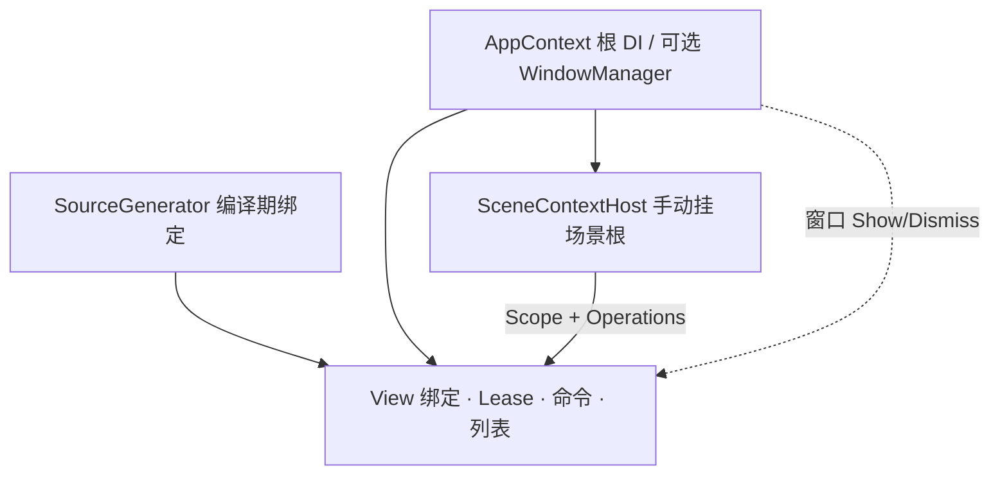
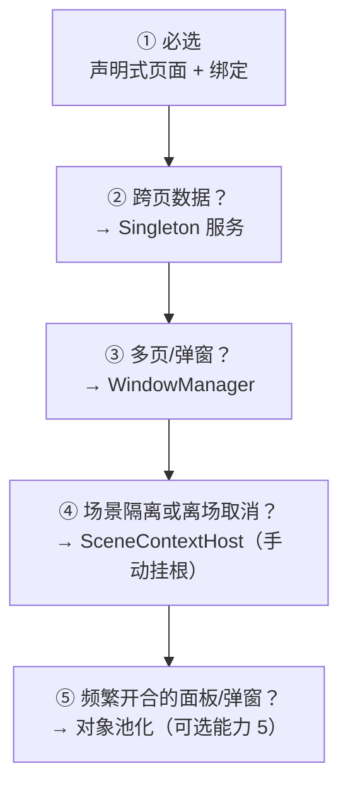

# DotPudica Framework - A MVVM Framework for Godot .NET

<div align="center">


</div>

        [](https://github.com/Cholopol/dot-pudica-framework/stargazers) [](https://github.com/Cholopol/dot-pudica-framework/network/members)

[English](README.md) | 简体中文

DotPudica 是面向 **Godot 4.7 + .NET 8** 的 MVVM 框架。把传统的 .NET 数据绑定迁移到 Godot 节点式 UI：View 控件与表现，ViewModel 状态、命令与流程；编译期源生成，AOT 友好。专注于跨平台的重度UI应用/游戏开发。

| 仓库条目                             | 用途                      |
| -------------------------------- | ----------------------- |
| `addons/dot-pudica`              | **游戏工程只需这一份**（插件交付物）    |
| `DotPudicaFramework` / `samples` | 本仓宿主工程 + Showcase 演示    |
| `tests` / `benchmarks`           | 本仓 CI / 证据，**不要拷进游戏工程** |
| `.github`                        | CI 与 Release 打包         |

### 快速开始

本仓库是**完整源码仓**（含样例、测试、基准）。开发游戏时**不要**把整个仓库拷进项目。

1. 从 [Releases](https://github.com/Cholopol/dot-pudica-framework/releases) 下载 `dot-pudica-*.zip`，或只复制本仓的 `addons/dot-pudica/`。
2. 解压/放到你的 Godot 工程根下，使路径为 `addons/dot-pudica/`。
3. 按下方「快速使用」启用插件并完成 Bootstrap——**不要**引用或复制 `tests/`、`benchmarks/`、`samples/`。

发版与 Release 说明（关联 Issue/PR）见 [CONTRIBUTING.md](CONTRIBUTING.md#版本与发版)。

### AI 助手Skills

插件附带一套**面向 AI 编程助手的技能集**，位于 `addons/dot-pudica/Skills/`（SKILL.md 格式），用于教会 AI 助手正确使用框架：

- **能力技能**——每个框架能力域（工程接入、页面与绑定、DI/场景 Scope、窗口、池化、消息与线程、验证）都带明确的输入输出契约与验收检查点。
- **路由技能**（`dotpudica-route`）——决定任务该调用哪个技能，以及正确的调用顺序（bootstrap 最先、验证收尾）。
- **工作流技能**——端到端配方（新工程接入、新增页面、弹窗、共享数据、场景 Scope、池化优化、修复 DOTPUDICA 诊断）。

使用方法：让 agent 指向 `addons/dot-pudica/Skills/` 并要求它先读 `dotpudica-route/SKILL.md`；或把该目录复制到 agent 的技能目录（如 `$env:USERPROFILE\.config\opencode\skills\`）。技能只覆盖插件公开 API。

***

## 设计理念

Q1: 为什么在 Godot 里用 MVVM？

Q2: 它和传统 Godot 写法的区别？

Q3: 它与桌面 MVVM 框架（WPF、Avalonia 等）的异同？

框架使用示例可以跳到「[快速使用](#快速使用最小可运行配置)」。

### 1. 为什么在 Godot 里使用 MVVM

Godot 原生的 UI 编程模型是”节点树 + 脚本 + 信号“：界面由节点搭出来，逻辑写在节点的脚本里，节点之间用信号通信。这套模型对小型界面非常直接，但随着项目扩展——菜单、背包、联机匹配等——两个问题会越来越突出：

- **状态同步靠手写**。同一个数据（玩家金币、房间状态、匹配进度）往往要驱动多个控件，传统写法是每次状态变化时手动遍历节点、逐个赋值。一旦状态在多个地方被修改，改了一处、忘了刷新另一处几乎是必然发生的事。
- **逻辑与表现耦合在节点上**。逻辑散落在各个脚本里，强依赖场景树；想对登录流程匹配流程做单元测试，得先搭场景、挂节点、模拟信号，测试成本远高于逻辑本身。

在MVVM的设计中 **ViewModel 持有状态与流程，View 只负责把它们映射成界面，分工明确层次清晰**。

本框架的 Core 层完全不引用 Godot，ViewModel 是普通 .NET 类——可以脱离引擎写单元测试；View 通过绑定把 VM 的属性、命令连到控件上，状态变化由绑定引擎自动推送到界面，不再需要手动刷新。View层与ViewModel层开发并行，有着极高的可维护性与开发效率。MVVM模式的三板斧：数据绑定、声明式UI与数据流，DotPudica都具备。

| 收益     | 说明                              |
| ------ | ------------------------------- |
| 状态单一来源 | 界面永远显示 VM 的当前状态，不存在容易失同步的副本     |
| 可测试    | 逻辑脱离场景树，纯 C# 单测，不启动 Godot       |
| 可复用    | 同一 VM 可被不同 View 驱动（换布局、换皮肤、换入口） |
| 泄漏风险可控 | 订阅与生命周期由框架代管，`[Subscribe]` 自动退订 |

**简单的控件界面、demo，原生写法更快**——多一层抽象总归有成本。当界面状态变多、需要跨页共享数据或需要数据驱动UI更新时，MVVM 的收益才开始放大。这也是本框架“能力按需叠加“的原因：最小配置只有声明式页面 + 绑定，窗口、Scope、共享服务都是用到才加。

### 2. 与传统 Godot 写法的区别

| 场景      | 传统 Godot 写法                     | DotPudica                                        |
| ------- | ------------------------------- | ------------------------------------------------ |
| 数据 → 界面 | 手写信号接线，状态变化时逐个控件手动刷新            | 属性绑定，VM 属性变化自动推送到控件                              |
| 界面 → 数据 | 控件信号 → 脚本读值、写回，代码散落各处           | 命令绑定 / `TwoWay` 绑定，方向在声明处集中表达                    |
| 逻辑位置    | 与节点混在同一脚本，强依赖场景树                | ViewModel 是纯 C# 类，不引用 Godot                      |
| 状态同步    | 多处手写，改一处漏一处                     | 绑定引擎统一同步，无副本可失同步                                 |
| 生命周期    | 手写 `_Ready`/`_ExitTree` 接线、手动退订 | `[DotPudicaView]` 声明式生命周期，订阅自动建立/解除              |
| 依赖注入    | 无，或手写全局单例                       | `AppContext` 根 DI + `SceneContextHost` 场景级 Scope |
| 错误发现时机  | 运行时（路径写错、信号名拼错）                 | 编译期诊断（DOTPUDICA 系列），绑定路径错误直接编译失败                 |
| UI 构建   | 场景编辑器 + 代码                      | 不变——绑定是附加层，不替代 Godot 编辑器工作流                      |

**优点**：状态单一来源、逻辑可单测、跨页共享数据有明确归属、绑定错误在编译期暴露、页面切换不泄漏。

**代价**：多一层抽象，初期比直接写信号多几行声明；绑定关系写在 C# 特性里而不是 `.tscn` 中，场景编辑器里看不到「谁绑了谁」，需要回看 View 源码；小型 UI 上收益不明显。

### 3. 与 Avalonia 等现代 MVVM 框架的对比

如果你熟悉 Avalonia、WPF 这类.NET生态 MVVM 框架，DotPudica 的大多数概念可以平迁；少数刻意不同的点，背后各有原因。目前的Alpha版本经历了四种方案的尝试，比如划分UI单元来实现预想的系统热插拔能力进而优化应用的内存管理、引入Controller概念来集中和复用业务逻辑等，但无一例外最后都被推翻了，最后稳定到今天的形态。当然也许是受作者的经验水平所限而没有落地，历史经验告诉我优秀的设计总是趋同进化的。如果你有好的想法也可以聊聊。

**相似的部分：**

- **三层 MVVM 分离**：View / ViewModel / Model 的职责划分与桌面 MVVM 一致——ViewModel 是不依赖 UI 的纯 .NET 类；Model 仍是普通 .NET 类型，由业务侧自行组织（见下文「不规定 Model 层」）；
- **同一套属性通知工具**：沿用 CommunityToolkit.Mvvm 的 `[ObservableProperty]` / `[RelayCommand]`，与 Avalonia 官方模板一致；
- `BindingMode` **语义相同**：`OneWay` / `TwoWay` / `OneWayToSource` / `OneTime`，默认模式同样按控件推断——输入控件默认 `TwoWay`，显示控件默认 `OneWay`；
- **强类型转换器**：`IValueConverter<TIn, TOut>` 热路径零装箱，思路对应 Avalonia 的 `FuncValueConverter`；
- **集合绑定**：`INotifyCollectionChanged` 驱动 `[ItemsSource]` 列表与虚拟列表；
- **DI 管理服务与 ViewModel**，支持进程级与场景级两种作用域；
- **订阅/退订是显式生命周期的一部分**，销毁时由框架统一清理。

**不同的部分：**

- **不规定 Model 层。** 框架产品边界是 View ↔ ViewModel 的绑定与生命周期管理：不提供 Entity / Repository / 领域模型基类，也不约定持久化或网络协议怎么写。游戏与应用的领域形态差异极大（DTO、存档、ECS、远程 API等等），定一套”正确 Model“只会把框架绑死在某一种建模上，也与按需叠加能力冲突。跨页 / 共享数据的正式落点是可注入的 Singleton 服务；Showcase 里的 `Shared/Models` 只是用户态 DTO 示例，不是框架契约。这与 WPF / Avalonia 通常也不规定领域层一致。业务数据如何分层、如何进入 ViewModel，需要项目自己约定。
- **没有 XAML，不发明标记语言。** Avalonia 的 View 层是 XAML 标记，绑定写在标记里；DotPudica 的 View 层是 Godot 场景（`.tscn`）+ 代码，绑定以 `[BindTo]` 等特性挂在节点字段上。
- **绑定是编译期生成的，不是运行时反射。** WPF 传统绑定与 Avalonia 早期都在运行时按字符串解析（Avalonia 11 起默认编译 XAML 绑定）；DotPudica 没有 XAML 管线，直接在 C# 特性上让 Roslyn 源生成器静态校验路径、生成强类型委托代码——路径错误在编译期就是错误，运行期零反射、AOT 友好。代价：绑定路径必须是编译期可静态解析的写法，运行时拼路径、动态创建目标都不支持——这是换取零反射与 AOT 的显式取舍。
- **没有 DataContext 隐式继承。** Avalonia/WPF 的绑定靠 DataContext 沿视觉树向下传递、写相对路径；DotPudica 的绑定一律是本 View 的 ViewModel 上的显式路径（支持 `Account.Username` 链式）。理由则是：Godot 的场景树与视觉树并不一一对应（容器、代理节点众多），隐式继承会让这个控件到底绑着谁难以预测；显式路径 + 编译期校验换来确定性。代价则是：每个绑定都要写清路径前缀。
- **View 需要手写两行** `_Ready() => InitializeView();` **/** `_ExitTree() => DisposeView();`**。** 这是 Godot 的硬约束而非设计偏好：Godot 只分发**用户源码中声明**的虚方法覆盖，而 Roslyn 源生成器之间互相不可见——生成器产出的 `_Ready` 永远不会被引擎调用。漏写这两行会直接报`DOTPUDICA046`。
- **View-first，显式声明 VM 类型。** Avalonia 常用 DataTemplate / ViewModelLocator 做类型 → View的隐式映射；DotPudica 用 `[DotPudicaView(typeof(TVM))]` 在 View 上直接声明 VM。Godot 场景实例化本来就是显式的，隐式映射只会增加维护成本；显式声明还让生成器在编译期就知道 VM 类型，从而能生成编译期工厂（零反射、AOT 友好）。
- **生命周期锚定场景树。** VM 的创建/销毁跟随节点的 `_Ready`/`_ExitTree`（进树绑定、出树销毁），多页与弹窗用 `GodotWindowManager` 叠层。Godot 没有桌面框架意义上的窗口，场景树进出树就是页面生命周期最自然的锚点。

***

## 能力一览与配置选择

### 全能力鸟瞰



| 层级  | 能力                                                             | 何时需要                      |
| --- | -------------------------------------------------------------- | ------------------------- |
| 编译期 | Attribute 绑定、诊断、声明式生命周期                                        | **始终**（引用 Analyzer 即可）    |
| 页面  | 声明式 VM 创建/注入/订阅、Owned/External VM、命令、列表、转换器、InteractionRequest | **始终**（最小 UI）             |
| 页面  | UI 调度（`IUiDispatcher`）+ 绑定侧合并投递（Coalescer）                     | **始终**（碰控件必回主线程；高频刷新自动合并） |
| 页面  | 对象池化：视图 `NodePool`、窗口 `ConfigurePool`/`ShowPooled`             | 频繁创建/销毁的面板、弹窗、列表行（回收复用）   |
| 应用  | AppContext、Singleton 服务                                        | 跨页共享数据                    |
| 应用  | WindowManager                                                  | 多全屏页 / 弹窗                 |
| 场景  | SceneContextHost → Scope + Operations                          | 场景隔离 DI，或离场取消异步（**须手动挂**） |

### 配置怎么选

按需叠加，**未列出的不要配**：



多数设置页 / 单机菜单做到 **① 或 ①②** 即可；联机房间、匹配取消再上 **④**；频繁开合的面板/弹窗需要复用节点时上 **⑤**。

***

## 快速使用：最小可运行配置

从空工程到第一个绑定跑通，只需要完成 **A → E** 五步。窗口、场景 Scope、共享服务都属于可选增强，这一步先不碰它们也能完整跑通。

### A. 环境

| 项     | 要求                                             |
| ----- | ---------------------------------------------- |
| Godot | **4.7.x .NET（Mono）** 版                         |
| SDK   | **.NET 8**                                     |
| 插件    | 将 `addons/dot-pudica` 放进你的工程后启用（见上文「装进你的游戏工程」） |

**新游戏工程**：只需 addon + 本页步骤 B–E。\
**本仓库 / Showcase**：已启用插件并配好引用，可当模板——用 Godot 打开根目录 `project.godot`，`Ctrl+Shift+B` 或：

```powershell
dotnet build DotPudicaFramework.sln
```

### B. 宿主 `.csproj`：插件自动注入

Godot .NET 工程创建时会在 `project.godot` 同级生成宿主 `.csproj`。**框架引用无需手写**：在编辑器 **项目 → 项目设置 → 插件** 启用 **DotPudica** 后，`plugin.gd` 会自动在宿主 `.csproj` 中注入并维护 `<!-- DotPudica:Begin -->` … `End` 之间的片段，且每次插件加载都会校验同步；只有禁用/卸载插件时才会移除。注入片段包含编译属性（`Nullable`/`ImplicitUsings`）、插件与本仓纯 .NET 测试/基准源码排除、`CommunityToolkit.Mvvm` 与 `Microsoft.Extensions.DependencyInjection` 包引用，以及 Core / Godot / SourceGenerator（作 Analyzer）三个项目引用（与 `addons/dot-pudica/plugin.gd` 中 `HOST_BLOCK` 一致；`tests/DotPudica.Integration` **不**排除，需编进宿主程序集）：

```xml
<!-- DotPudica:Begin -->
  <PropertyGroup>
    <Nullable>enable</Nullable>
    <ImplicitUsings>enable</ImplicitUsings>
    <DefaultItemExcludes>$(DefaultItemExcludes);tests/DotPudica.Tests/**;benchmarks/**</DefaultItemExcludes>
  </PropertyGroup>

  <ItemGroup>
    <Compile Remove="addons/dot-pudica/**/*.cs" />
    <Compile Remove="tests/DotPudica.Tests/**/*.cs" />
    <Compile Remove="benchmarks/**/*.cs" />
  </ItemGroup>

  <ItemGroup>
    <PackageReference Include="CommunityToolkit.Mvvm" Version="8.4.0" />
    <PackageReference Include="Microsoft.Extensions.DependencyInjection" Version="8.0.1" />
  </ItemGroup>

  <ItemGroup>
    <ProjectReference Include="addons/dot-pudica/Core/DotPudica.Core.csproj" />
    <ProjectReference Include="addons/dot-pudica/Godot/DotPudica.Godot.csproj" />
    <ProjectReference Include="addons/dot-pudica/SourceGenerator/DotPudica.SourceGenerator.csproj"
                      OutputItemType="Analyzer"
                      ReferenceOutputAssembly="false" />
  </ItemGroup>
<!-- DotPudica:End -->
```

> **注意**：注入要求宿主 `.csproj` 已存在——若在创建 C# 工程之前就启用了插件，插件会跳过注入并打印提示，重新启用一次插件即可补齐；已手写过旧版引用的工程，插件会按 Begin/End 标记同步为最新内容。片段中的 `tests/DotPudica.Tests` 与 `benchmarks` 排除只与本仓库目录有关，其他工程没有这些目录时无副作用。

### C. 应用上下文（最小 Bootstrap）

在主场景最早进树的节点（或 Autoload）上初始化一次，整个进程生命周期内只此一份。窗口管理器可选——没有弹窗时可以传 `null`。

```csharp
using DotPudica.Godot;
using DotPudica.Godot.Views;
using Godot;
using Microsoft.Extensions.DependencyInjection;
using AppContext = DotPudica.Godot.AppContext;

public partial class GameBootstrap : Node
{
    private AppContext? _app;

    public override void _EnterTree()
    {
        // 若需要弹窗/全屏页切换，先准备 GodotWindowManager 子节点再传入
        GodotWindowManager? wm = GetNodeOrNull<GodotWindowManager>("WindowManager");

        _app = new AppContext().Initialize(services =>
        {
            // 最小：可不注册任何服务，页面里直接 new ViewModel 即可
            // services.AddSingleton<IInventoryService, InventoryService>();
        }, wm);

        base._EnterTree();
    }

    public override void _ExitTree()
    {
        _app?.Dispose();
        _app = null;
        base._ExitTree();
    }
}
```

> **注意**：`SceneContextHost` 不会自动出现在场景中，需要时手动挂载；且任何 Host **进树之前**，`AppContext.Initialize` 必须先完成。

### D. 最小 View + ViewModel

**ViewModel** 不引用 Godot，是普通 .NET 类：

```csharp
using CommunityToolkit.Mvvm.ComponentModel;
using DotPudica.Core.ViewModels;

public partial class MyPanelViewModel : ViewModelBase
{
    [ObservableProperty]
    private string _title = "Hello DotPudica";
}
```

**View**：在场景里放好控件，在检查器里把 Label 赋给导出的 `_title` 字段；类上声明一个 `[DotPudicaView]` 特性，整个页面就声明完了：

```csharp
using DotPudica.Core.Binding;
using DotPudica.Core.Binding.Attributes;
using DotPudica.Godot.Views;
using Godot;

[DotPudicaView(typeof(MyPanelViewModel))]
public partial class MyPanelView : Control
{
    [Export, BindTo(nameof(MyPanelViewModel.Title), Mode = BindingMode.OneWay)]
    private Label _title = null!;

    public override void _Ready() => InitializeView();
    public override void _ExitTree() => DisposeView();

    partial void OnViewReady() { /* 在这里构建 UI */ }
}
```

源生成器在 `InitializeView()` / `DisposeView()` 背后生成完整生命周期：服务注入 → `OnViewReady()` →
编译期 VM 工厂 → `SetViewModel`/`DotPudicaInitialize` → 事件订阅 → `OnViewModelBound()`；
销毁时 `OnViewDisposing()` → 自动退订 → `DotPudicaDispose()`。
两行 Godot 覆盖为必需：Godot 只分发**用户源码**中声明的虚方法覆盖（源生成器之间互相不可见），
漏写会报 `DOTPUDICA046`。

**声明式 View 参考**：

| 成员                                                              | 作用                                                            |
| --------------------------------------------------------------- | ------------------------------------------------------------- |
| `_Ready() => InitializeView()`                                  | 必需：执行生成的生命周期（注入、建 VM、绑定、订阅）                                   |
| `_ExitTree() => DisposeView()`                                  | 必需：执行销毁流程（退订、Dispose）                                         |
| `partial void OnViewReady()`                                    | 可选钩子：构建 UI（此时 VM 尚不存在）                                        |
| `partial void OnViewModelBound()`                               | 可选钩子：VM 已就绪且非空——导航、启动服务                                       |
| `partial void OnViewDisposing()`                                | 可选钩子：仍可访问 VM——取消 scope、手动清理                                   |
| `[Inject]` 字段/属性                                                | 在 `OnViewReady` 之前从 `AppContext.Current.Services` 注入服务        |
| `[ViewModelFactory]` 方法                                         | 参数受限的工厂方法，用于构造函数无法从 DI 完全解析的 VM                               |
| `[Subscribe("Event")]` 方法                                       | 绑定后自动订阅 VM 事件，销毁时自动退订（消除最常见泄漏点）                               |
| `[DotPudicaView(..., AutoInitialize = false)]`                  | 共享面板：跳过生成的 VM 创建/绑定，保留手动 `SetViewModel`/`DotPudicaInitialize` |
| `[DotPudicaView(..., Ownership = ViewModelOwnership.External)]` | 默认 `Owned`；`External` 时销毁不 Dispose VM                         |

**规则**：VM 恰好一个公开构造函数且所有参数为接口类型时，生成器生成编译期工厂
`new T(services.GetRequiredService<...>())`（零反射、AOT 友好）；非接口参数 / 多构造函数
必须提供 `[ViewModelFactory]` 方法，否则报 `DOTPUDICA040` / `DOTPUDICA041`。

### E. 验收

1. `dotnet build` 无错误——绑定路径、VM 工厂、订阅签名等错误在编译期就报成诊断，而不会留到运行时。
2. 运行场景，Label 显示 `Hello DotPudica`。
3. 本仓库完整样例：主场景指向 Showcase 后按 **F5**（`samples/Showcase`）。

跑通之后，下一章”按需加能力“按场景叠加即可。

***

## 可选：按需加能力

最小闭环（A–E）已可做单页绑定。下面按需叠加。

### 1）命令绑定

```csharp
// ViewModel
[RelayCommand]
private void Save() { /* ... */ }

// View
[Export, BindCommand(nameof(MyPanelViewModel.SaveCommand))]
private Button _saveButton = null!;
```

### 2）共享服务（跨页数据）

在 Bootstrap 的 `Initialize` 里注册 Singleton，页面声明式取用：

```csharp
//Bootstrap 
services.AddSingleton<IProfileService, ProfileService>();

// 页面：构造函数参数全是接口 → 生成器自动解析；或显式 [Inject]
[DotPudicaView(typeof(LoginViewModel))]
public partial class LoginPage : ShowcasePageWindow
{
    [Inject]
    private IProfileService _profileService = null!;
}
```

- **服务**长寿命、进 AppContext；**页面 ViewModel** 短寿命、默认 `Owned`（销毁时自动释放）。
- 同页多面板共用一份 VM：子面板 `[DotPudicaView(..., AutoInitialize = false)]` + `BindShared(vm)`（`SetViewModel(vm, ViewModelOwnership.External)` 手动接线，关面板不 Dispose VM）。

### 3）窗口叠层

场景中放置 **一个** `GodotWindowManager` 节点（进程级单例，整个应用只需要一个，`AppContext.Initialize` 也只接受一个），并在 `Initialize(..., windowManagerNode)` 传入；全屏页/弹窗继承 `GodotWindow`，用 `WindowManager.Show` / `Dismiss`。\
位置要求：放在主场景常驻分支下（Bootstrap 同层或子节点均可，样例用 `GetNodeOrNull<GodotWindowManager>("WindowManager")` 查找），并在任何 `Show` 之前完成 `AppContext.Initialize`。放了多个节点时，只有传给 `Initialize` 的那个参与窗口管理，其余只是普通节点。\
对照：`samples/Showcase/ShowcaseBootstrap.cs`、`Gallery/Windows`。

### 4）场景 Scope（DI 子范围 + 异步取消）

`SceneContextHost` 是框架提供的 `Node`（`DotPudica.Godot.SceneContextHost`），**不会自动挂载**，需要你在场景里**手动**挂上：

| 方式  | 做法                                                      |
| --- | ------------------------------------------------------- |
| 编辑器 | 选中房间/关卡等**场景根节点** → 附加脚本 → 选 `SceneContextHost`         |
| 代码  | `AddChild(new SceneContextHost { Name = "RoomScope" })` |

不挂 Host 就没有场景级 `Scope` / `Operations`；单页自己 `new ViewModel()` 时可以不挂。\
挂载后：进树创建 DI 子范围与取消域，退树自动拆掉。须保证 **Bootstrap 的** `AppContext.Initialize` **已完成** 后再让 Host 进树。

**设计精髓：从 Host 取 VM。**

- **根 DI 与场景 DI 寿命不同。** 默认生成器从 `AppContext` 根容器建 VM；场景 Transient / Scoped 依赖必须从当前 Host 的 `IServiceScope` 解析，否则会串局或泄漏到下一场景。
- **View 决定何时建，Host 决定从哪建。** `[ViewModelFactory]` 是二者交汇点：工厂里显式定位 Host（如 `GetParent()`），再 `host.Scope.ViewModels.Create<T>()`。
- **所有权仍归 View。** Host 只供应 Scope，不持有页面 VM；页面默认 Owned，退树时子 View 先 Dispose VM，父 Host 再拆 Scope（Godot 保证子先于父 `_ExitTree`）。
- **Node 树与 DI 的联系只能在 View 侧。** `ISceneScope` 不在根容器注册，VM 又不引用 Godot；能同时看到树上 Host 与 DI `Create` 的，正是 View 上的工厂方法。
- **Host 保持可选。** 不需要场景隔离时继续走根工厂 / `new`；房间、匹配等才叠加这一层。
- `SceneContextHost` 作用**在这个场景的 DI 边界里，用 DI 装配出一份短命 VM**。既自动注入，又和场景生命周期相同。

推荐节点树：

```text
RoomRoot (脚本: SceneContextHost)    ← 你手动挂在这里
  └── YourPage                     ← 需要用 Scope 的页面放子树下
```

```csharp
// 需先 AddTransient<MatchViewModel>()；页面置于 SceneContextHost 子树下
[ViewModelFactory]
private MatchViewModel CreateMatch()
{
    var host = GetParent() as SceneContextHost
        ?? throw new InvalidOperationException("将页面放在 SceneContextHost 子树下，或自行查找 Host");
    return host.Scope.ViewModels.Create<MatchViewModel>();
}
```

- `host.Scope`：场景级 DI
- `host.Operations`：离场景取消异步\
  对照：`samples/Showcase/Gallery/ScopesAndDi`、`MiniGame/Match`。

### 5）对象池化（View / 窗口复用）

频繁创建/销毁的界面（物品详情面板、弹窗等）可池化：**回收时不销毁节点，只摘树 + 解绑 + 断 VM；取用时挂树重绑**。池按 `maxSize` 有界，**回收超过容量时多出的节点直接** `QueueFree` **销毁**。

#### a: 视图池化（手动激活，`AutoInitialize = false`）

```csharp
// 视图：声明 Pooled，生命周期第二行换成 RecycleView()
[DotPudicaView(typeof(ItemDetailViewModel), AutoInitialize = false, Pooled = true)]
public partial class ItemDetailPanel : VBoxContainer
{
    public override void _Ready() => InitializeView();

    public override void _ExitTree() => RecycleView();

    // 生成方法：External 重绑 + 重新接线（含 [Subscribe] 重订阅）
    public void BindShared(ItemDetailViewModel vm) => ActivateViewModel(vm);
}
```

```csharp
// 持有方：自建池（也可用任意 IObjectPool 实现），pool 由持有方持有
var pool = NodePool.Create<ItemDetailPanel>(maxSize: 4);

var view = pool.Allocate();           // 池空则 new，否则复用回收节点
host.AddChild(view);                  // 进树触发 _Ready → InitializeView
view.BindShared(itemVm);              // 重绑新 VM

view.GetParent()?.RemoveChild(view);  // 出树自动触发 RecycleView（解绑+退订+断 VM，节点存活）
pool.Free(view);                      // 入池缓存；池满则 QueueFree 销毁
```

语义要点：

- **出树即回收**：`RemoveChild` 与 `QueueFree` 都会触发 `_ExitTree → RecycleView()`——解绑、退订、断 VM 引用一次完成，节点不销毁。
- **VM 归持有方**：`ActivateViewModel(vm)` 强制 `External` 所有权，回收时只断引用不释放 VM。
- **契约**：池化对象不要直接 `QueueFree`（会在池内留下失效条目），一律走 `pool.Free`。

#### b: 视图池化（自动初始化，`AutoInitialize = true`）

与窗口池化方式统一：回收（摘树）时 `RecycleView()` 自动 `RequestReady()`，下次挂树重跑 `_Ready → InitializeView`——**全新 Owned VM + 绑定**。持有方只负责借还节点，不建 VM、不释放 VM：

```csharp
// 视图：Pooled = true（AutoInitialize 默认 true）
[DotPudicaView(typeof(ItemDetailViewModel), Pooled = true)]
public partial class ItemDetailPanel : VBoxContainer
{
    public override void _Ready() => InitializeView();

    public override void _ExitTree() => RecycleView();
}
```

```csharp
// 持有方：只借还节点，VM 由视图自建自管
var pool = NodePool.Create<ItemDetailPanel>(maxSize: 4);

var view = pool.Allocate();
host.AddChild(view);                  // 进树 → _Ready → InitializeView：新 Owned VM + 绑定

view.GetParent()?.RemoveChild(view);  // 出树 → RecycleView：解绑 + 释放 VM + 重武装 _ready
pool.Free(view);                      // 入池缓存；池满则 QueueFree 销毁
```

共享 VM（多视图绑同一实例）场景继续使用手动激活模式（上文）。

#### c: 窗口池化（管理器托管，可 `AutoInitialize = true`）

```csharp
// 窗口：Pooled = true（AutoInitialize 默认 true——每次激活由视图自建全新 Owned VM）
[DotPudicaView(typeof(PooledPopupViewModel), Pooled = true)]
public partial class PooledPopup : GodotWindow
{
    public override void _Ready() => InitializeView();

    public override void _ExitTree() => RecycleView();
}
```

```csharp
// 使用方：管理器注册一次（幂等，同容量重复调用无副作用），之后 ShowPooled 显示
wm.ConfigurePool<PooledPopup>(maxSize: 2);
wm.ShowPooled<PooledPopup>();   // 池空则新建，否则复用回收节点
wm.Dismiss(window);             // Dismiss 转场结束后自动回收（摘树 + 生命周期归零 + 入池）
```

语义要点：

- **Dismiss 即回收**：转场结束自动摘树、生命周期归零（`Created`/`Dismissed` 复位），下次 `ShowPooled` 复用同一节点；`_ExitTree → RecycleView()` 同样自动执行。
- **每次激活新 VM**：`AutoInitialize = true` 时回收已 `RequestReady()`（Godot 的 `_ready()` 每节点一生只调用一次），重挂树后重跑 `InitializeView()`——新 Owned VM + 绑定，回收时该 VM 被释放。
- **兜底**：`wm.Clear()`（无谓词）与窗口管理器随场景销毁时，池内缓存节点一并销毁。
- **池化视图统一流程**：所有池化视图（窗口与普通 `Node`/`Control`）回收时 `RecycleView()` 自动 `RequestReady()`，重挂树后自动重跑 `_Ready → InitializeView`（新 Owned VM + 绑定）——两种 `AutoInitialize` 模式一致；复用窗口每次激活都会重新走 `Create()`/`OnCreate()`（`ShowPooled` 传入的 bundle 会在每次激活重放），一次性数据建议由新 VM 获取。

对照：`samples/Showcase/Gallery/Pools`（视图池化演示卡）、`Gallery/Windows`（7. Pooled Popup窗口池化演示卡）。

### 6）线程调度与操作批处理

Godot 控件只能在主线程访问；ViewModel 通知、网络回调却常从后台冒出。框架用两层机制处理：**调度回主线程**，以及**同类更新合并为最新一次**。页面 `_Ready` 里 `CaptureUiContext` 会抓住 Godot 的 `SynchronizationContext`，之后绑定写控件都走这套路径——**默认开启，无需额外配置**。

**调度：`IUiDispatcher`**

| API             | 作用                                    |
| --------------- | ------------------------------------- |
| `CheckAccess()` | 当前是否已在 UI 线程                          |
| `Post(Action)`  | 已在 UI 线程则同步执行，否则投递到 Godot SyncContext |

具体实现：`UiDispatcher.Immediate`（单测）、`FromSynchronizationContext`（正式宿主）。业务侧也可注入同一 dispatcher，自行 `Post` 回主线程改 VM / UI。

**批处理：`UiDispatchCoalescer`（绑定内部）**

不是事务式「攒一批再提交」，而是**调度合并**：同一绑定通道上，未执行完前再来更新 → **不再重复 Post**；主线程执行时只应用**最新版本**。属性 → 控件、集合同步、虚拟列表刷新、`CanExecute` 等目标侧热路径都走它。

效果：后台一秒改 Progress 100 次，主线程往往只刷几次当前值，而不是 100 次控件赋值。

本机可复现的对照数字与图见：

- 桌面（JIT / headless）：[benchmarks/report/RESULTS.md](benchmarks/report/RESULTS.md)（`.\benchmarks\run-all.ps1`）
- iOS 真机 NativeAOT：[benchmarks/report/RESULTS_IOS.md](benchmarks/report/RESULTS_IOS.md)（导出包跑 `BenchmarkRunner.tscn`）

**业务侧合并：`LatestSnapshotMailbox<T>`**

高频推送（网络快照等）可自用：后台 `Publish(不可变快照)` 只保留最后一份；主线程 `TryDrainLatest` 有则应用一次。与 Coalescer 同思路——多写一读，只要最新。可对照：`samples/Showcase/Gallery/ThreadingLab`。

**与** **`SceneOperationScope`** **分工**

| 组件                    | 作用                                    |
| --------------------- | ------------------------------------- |
| `IUiDispatcher`       | 在哪条线程跑                                |
| Coalescer / Mailbox   | 同类更新合并几次                              |
| `SceneOperationScope` | 离场取消异步（`CancellationToken`），**不是**调度器 |

使用约束：

- 绑了 `ItemsSource` 的集合**只能在主线程改**；后台产不可变结果（静态快照），再 `Post` / Mailbox 到主线程一次替换或刷新。
- 普通属性可在后台 `OnPropertyChanged`；绑定会自行 Post + 合并后写控件。
- **没有**全局帧预算调度器；Profiler 证明 Post 积压拖慢输入/动画时再考虑。

### 7）全局配置模板

### 可直接复制使用的一套完整的进程级引导：主场景常驻节点上确保 `GodotWindowManager` 存在、初始化 `AppContext`、按需注册窗口池。复制到你的主场景根节点脚本（或 Autoload）即可。

```csharp
using DotPudica.Godot;
using DotPudica.Godot.Views;
using Godot;
using Microsoft.Extensions.DependencyInjection;
using AppContext = DotPudica.Godot.AppContext;

public partial class GameBootstrap : Node
{
    private AppContext? _app;
    private GodotWindowManager? _windowManager;

    /// <summary>全局窗口管理器（AppContext.Initialize 之后可用）。</summary>
    public GodotWindowManager WindowManager => _windowManager
        ?? throw new InvalidOperationException("GameBootstrap 尚未进树");

    public override void _EnterTree()
    {
        _windowManager = EnsureWindowManager();

        _app = new AppContext().Initialize(services =>
        {
            // 1. 跨页共享服务（可选）
            // services.AddSingleton<IInventoryService, InventoryService>();
            // 2. 场景级 DI（SceneContextHost）用到的 VM 注册为 Transient
            // services.AddTransient<MatchViewModel>();
        }, _windowManager);

        // 3. 窗口池注册（可选，幂等）：频繁开合的弹窗按类型注册容量
        // _windowManager.ConfigurePool<MyPopupWindow>(maxSize: 4);

        base._EnterTree();
    }

    /// <summary>确保 WindowManager 存在：场景里已放则用现成的，否则代码创建。</summary>
    private GodotWindowManager EnsureWindowManager()
    {
        var existing = GetNodeOrNull<GodotWindowManager>("WindowManager");
        if (existing is not null)
            return existing;

        var placeholder = GetNodeOrNull("WindowManager");
        placeholder?.QueueFree();

        var wm = new GodotWindowManager { Name = "WindowManager" };
        AddChild(wm);
        return wm;
    }

    public override void _ExitTree()
    {
        _app?.Dispose();   // 会调用 wm.Clear()：收掉栈上窗口 + 销毁池内缓存
        _app = null;
        base._ExitTree();
    }
}
```

场景节点树（主场景）：

```text
Main (GameBootstrap)      ← 主场景根，常驻分支
  └── WindowManager       ← 全局窗口栈 / 窗口池（也可在编辑器里手动放）
```

要点：

- **只挂常驻分支**：Bootstrap 与 WindowManager 必须位于主场景根 / Autoload 下，不要挂在会被场景切换卸载的页面分支里。
- **顺序**：`AppContext.Initialize` 与 `ConfigurePool` 在任何 `Show` / `ShowPooled` 之前完成；任何 `SceneContextHost` 进树之前 `Initialize` 必须已完成。
- **一次性**：`AppContext` 进程内只初始化一次，重复 `Initialize` 抛错；`Current` 未初始化时访问抛错。
- **DI 可注入**：`Initialize` 已把管理器注册为 `IWindowManager` 单例——页面可用 `[Inject] IWindowManager` 取用，不必静态访问 `AppContext.Current.WindowManager`。
- **池跨场景**：窗口池是管理器级的，回收节点可在任意场景复用；场景切换想清掉旧场景残留在栈上的窗口，在切换点调 `wm.Clear(predicate)`（或 `wm.Clear()`，后者同时销毁池内缓存）。
- **Autoload 备选**：不想在主场景里放 Bootstrap 时，把同样逻辑放进 Godot Autoload 单例节点的 `_EnterTree`（Autoload 跨场景常驻，语义等同进程级）。

### 8）生命周期

| 概念                                                          | 作用                                                                         |
| ----------------------------------------------------------- | -------------------------------------------------------------------------- |
| `[DotPudicaView(typeof(TVM))]`                              | 声明式页面：`InitializeView()` 自动完成注入 → 建 VM → 绑定 → 订阅 → 销毁                      |
| `_Ready => InitializeView()` / `_ExitTree => DisposeView()` | 必需的两行 Godot 覆盖（Godot 只分发用户源码中的虚方法）                                         |
| `OnViewReady / OnViewModelBound / OnViewDisposing`          | 可选 `partial void` 钩子，插入生命周期关键节点                                            |
| `[Subscribe("Event")]`                                      | 自动订阅/退订 VM 事件，杜绝泄漏                                                         |
| `[ViewModelFactory]`                                        | 非 DI 可解析 VM 的工厂方法兜底                                                        |
| `Pooled = true`                                             | 池化视图/窗口：生成 `RecycleView()`，`_ExitTree => RecycleView()`（解绑+退订+断 VM，节点存活复用） |
| `ActivateViewModel(vm)`                                     | 池化视图（`AutoInitialize = false`）重绑入口：External 接线 + 重新初始化（含重订阅）               |
| `ConfigurePool<T>(maxSize)` / `ShowPooled<T>()`             | 窗口管理器按类型注册池 / 显示池化窗口（Dismiss 自动回收；池满/兜底销毁）                                 |
| `AutoInitialize = false`                                    | 共享面板：手动 `SetViewModel(vm, External)` + `DotPudicaInitialize()`             |
| `SceneContextHost`                                          | 框架 Node，**需手动挂到场景根**；进树开 Scope，退树拆掉（不挂则无场景级 DI/取消）                         |
| `AppContext`                                                | 进程级根 DI + 可选 WindowManager                                                 |
| `IUiDispatcher` / `Post`                                    | 绑定与业务把 UI 工作投回 Godot 主线程；已在主线程则同步执行                                        |
| `LatestSnapshotMailbox<T>`                                  | 后台只保留最新不可变快照，主线程按需 Drain 一次应用                                              |

***

## 构建与验证

本仓库自带完整样例与测试，改动框架或样例后请用以下命令验证：

```powershell
dotnet build DotPudicaFramework.sln
# 编辑器 F5；或设置 GODOT_BIN 后 headless 集成测试：
& $env:GODOT_BIN --headless --path . res://tests/DotPudica.Integration/IntegrationTestRunner.tscn
```

单元测试：

```powershell
dotnet test tests/DotPudica.Tests/DotPudica.Tests.csproj
```

***

## 版本 v1.1.0 说明

- 声明式 View 生命周期：`[DotPudicaView]` 单特性声明完整页面 —— 源生成器自动完成
  服务注入（`[Inject]`）、编译期 VM 工厂、事件订阅/退订（`[Subscribe]`）、
  `InitializeView()`/`DisposeView()` 生命周期接线（钩子 `OnViewReady`/`OnViewModelBound`/`OnViewDisposing`），
  共享面板用 `AutoInitialize = false`；虚拟列表可用 `[ItemsSource]` 声明式绑定。
- 对象池化：`[DotPudicaView(Pooled = true)]` 视图（`NodePool` 持有方自持）与窗口
  （管理器 `ConfigurePool`/`ShowPooled`，Dismiss 自动回收）支持回收复用——回收不销毁节点，
  解绑/退订/断 VM 后入池，池满 `QueueFree` 销毁；窗口每次激活创建全新 Owned VM。
- UI 线程：绑定经 `IUiDispatcher` 回主线程写控件，目标侧更新经 Coalescer 合并最新一次；
  高频业务快照可用 `LatestSnapshotMailbox`；无全局帧预算调度器。
- Godot 只分发用户源码声明的虚方法，因此每个 View 需两行 `_Ready => InitializeView()` /
  `_ExitTree => DisposeView()`（漏写报 `DOTPUDICA046`）。
- 对于 AOT 支持：桌面路径已验证（含 headless 集成测试）；iOS 导出 NativeAOT 下 Godot 指标场景已实证（见 [RESULTS_IOS.md](benchmarks/report/RESULTS_IOS.md)）。
- 完整导航栈不在框架技术路线范围内，推荐窗口 + 场景组合。
- Model / 领域建模亦不在框架技术路线范围内：跨页数据用 Singleton 服务，领域类型用普通 .NET 类即可。
- 本框架在探索集成类似ECS的实体组件系统，它更偏向于追求灵活可追溯的数据管理方式。

## 贡献

- 稳定发布线：`master`
- 社区 PR 请提向 `v1.x`（版本管理与合并线；详见 [CONTRIBUTING.md](CONTRIBUTING.md)）

## 许可证

MIT。
