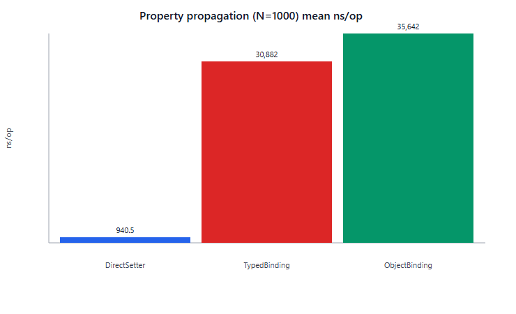
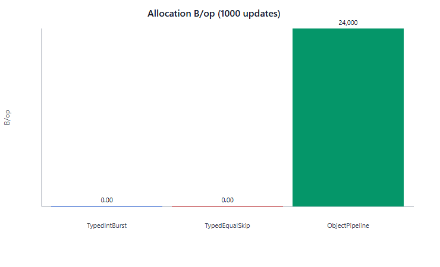
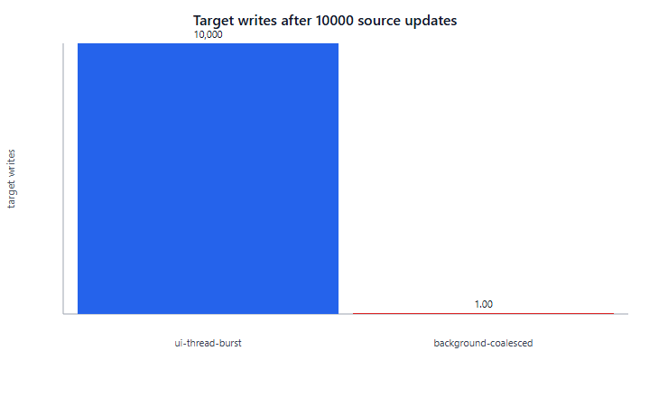
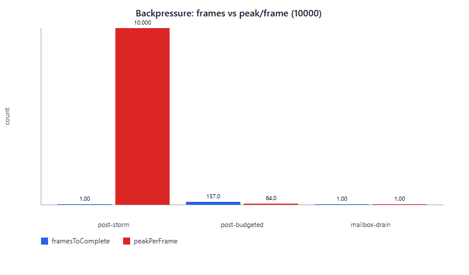
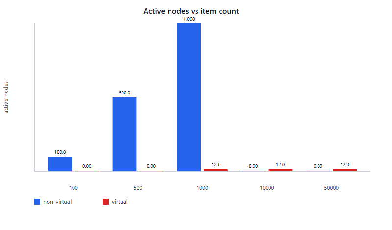
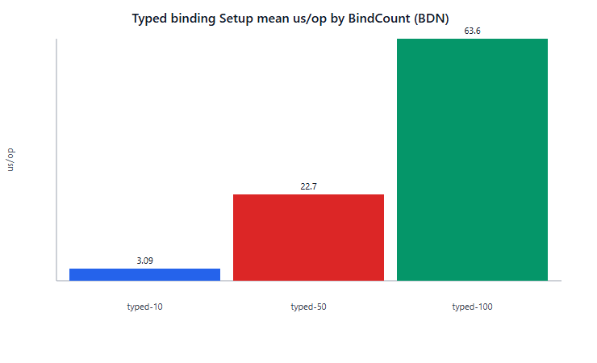
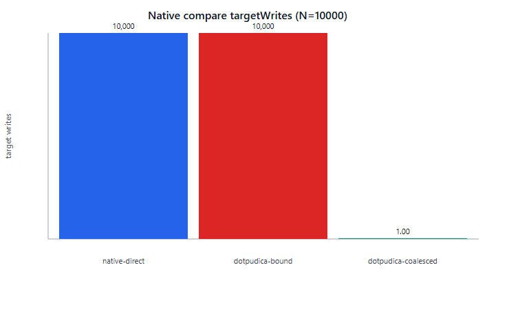

# DotPudica Benchmark Report (Desktop · Dual-machine comparison)

> Dual-machine desktop measurements: **macOS / Apple M4** and **Windows 11 / i7-11800H**.\
> **iOS NativeAOT device:** [RESULTS_IOS.md](RESULTS_IOS.md)

## Environment comparison

| Item | macOS | Windows |
| ----- | -------------------------------------------- | -------------------------------------------- |
| OS | macOS 26.5.1 | Windows 11 |
| CPU | Apple M4 | 11th Gen Intel Core i7-11800 |
| .NET | .NET 10.0.9 (TFM net8.0, LatestMajor; RyuJIT) | .NET 8.0.29 (TFM net8.0; RyuJIT AVX-512) |
| Godot | 4.7.1 (.NET) headless | 4.7.1 (.NET) headless |
| Test version | v1.1.0 | v1.1.0 |
| Pipeline | `run-all.ps1` (Core BDN 21 + Godot 6 scenarios PASS) | `run-all.ps1` (Core BDN 21 + Godot 6 scenarios PASS) |

Note: Desktop runs are JIT, not export AOT. Charts were generated on **Windows**; numbers in the dual-column tables in this document are authoritative. The binding-setup chart uses BenchmarkDotNet `BindingSetupBenchmarks` (not single-shot EvidenceCollector).

## Charts (Windows)

## Overview: stable vs variable

| Dimension | Same on both machines? | Notes |
| ---------------------- | -------- | -------------------------------------------------------------- |
| Typed hot-path allocation | **Same** | TypedInt / EqualSkip are **0 B/op** on both; Object is **24000 B/op** on both |
| Coalescer structure | **Same** | 10k source updates → targetWrites=1, pendingPosts=1; UI-thread burst still 1:1 |
| Godot PropertyBurst | **Same** | 1000/10000 → targetWrites=1 |
| Native three-way structure | **Same** | coalesced writes ≪ source updates; bound/native near 1:1 |
| Backpressure structure | **Same** | storm single-frame 10k; budgeted 157 frames / peak 64; mailbox 1/1/1 |
| Virtual list nodes | **Same** | virtual 1k–50k **activeNodes=12** on both; non-virtual linear in row count |
| Pool hit rate | **Same** | view/window both created=1, reused=49 |
| Typed vs Object latency ranking | **Flipped** | Mac: Object slightly faster; Win: Typed slightly faster |
| Direct absolute ns, list bindMs | **Machine-dependent** | Do not cross-compare absolutes; look at relative ratios |

## Godot UI decision table

| Scenario | Recommendation | Evidence |
| ---------- | --------------------- | ------------------------------------ |
| Background progress / HP spam | Binding + Coalescer | Dual-machine native-compare / coalesce; same structure on iOS |
| Network snapshots | Mailbox; or self-built frame-budgeted Post | Dual-machine backpressure structure matches |
| Lists larger than ~1k rows | Virtual list | Dual-machine activeNodes near-constant |
| Frequent panels / popups | ViewPool / WindowPool | Dual-machine reused≈iterations−1 |
| Static, very few controls | Hand-written assignment OK | Direct ≪ Typed (similar order of magnitude on both) |

***

## 1. Property propagation: Direct vs Typed vs Object

| Path | macOS ns/op (N=1000) | Windows ns/op (N=1000) | vs Direct (Mac / Win) |
| ------------- | -------------------: | ---------------------: | -------------------- |
| DirectSetter | 571.90 | 940.49 | 1.00× / 1.00× |
| TypedBinding | 36,880.54 | 30,882.09 | ≈64.5× / ≈32.8× |
| ObjectBinding | 34,639.63 | 35,642.32 | ≈60.6× / ≈37.9× |

Windows N=10000: Direct ≈9.48 µs, Typed ≈308.5 µs (≈32.6×), Object ≈354.6 µs (≈37.4×).

**Comparison conclusion:**

- Direct is the upper bound for small main-thread assignments on both sides; absolute ns varies with CPU (M4 lower) and is not meaningful to compare.
- Typed / Object are **same latency order of magnitude**; **ranking flips**: Mac Object ~6% faster, Win Typed ~15% faster.
- Choose by **Typed zero allocation**, not which BDN run wins.

## 2. Allocation

| Path | macOS B/op | Windows B/op |
| ------------------- | ---------: | -----------: |
| TypedIntBurst | 0.00 | 0.00 |
| TypedEqualSkipped | 0.00 | 0.00 |
| ObjectPipelineBurst | 24,000.00 | 24,000.00 |

**Comparison conclusion:** Allocation evidence is **identical** across machines, most directly supporting the README claim of “strongly typed hot path, zero boxing”; the object pipeline has a fixed boxing cost.

## 3. Coalesced dispatch

Core evidence (10000 source updates) — same on both sides:

| Mode | targetWrites | pendingPosts |
| -------------------- | -----------: | -----------: |
| ui-thread-burst | 10000 | 0 |
| background-coalesced | 1 | 1 |

Godot PropertyBurst:

| sourceUpdates | targetWrites (Mac / Win) | framesToSettle | elapsedMs (Mac / Win) |
| ------------: | ----------------------- | -------------: | -------------------- |
| 1000 | 1 / 1 | 0 / 0 | 5.33 / 8.95 |
| 10000 | 1 / 1 | 0 / 0 | 7.31 / 6.97 |

**Comparison conclusion:** Structural counts match across machines (coalesced to 1 write); elapsedMs varies by machine and can be ignored. iOS is also 1000/10000→1.

## 4. Native Godot three-way compare

| mode | N | targetWrites (Mac / Win) | elapsedMs (Mac / Win) |
| ------------------- | ----: | ----------------------- | -------------------- |
| native-direct | 1000 | 1000 / 1000 | 8.46 / 7.75 |
| dotpudica-bound | 1000 | 1000 / 1000 | 7.20 / 6.85 |
| dotpudica-coalesced | 1000 | 1 / 1 | 6.66 / 7.06 |
| native-direct | 10000 | 10000 / 10000 | 8.22 / 8.00 |
| dotpudica-bound | 10000 | 10000 / 10000 | 6.06 / 6.92 |
| dotpudica-coalesced | 10000 | 1 / 1 | 6.75 / 6.90 |

**Comparison conclusion:** **Write semantics** of the three modes match on both machines; background spam should use the Coalescer, not hand-written per-update Post. Absolute ms values are close but should not be ranked.

## 5. Backpressure

| mode | executed | framesToComplete (Mac / Win) | peakPerFrame (Mac / Win) |
| :-----------: | :------: | --------------------------- | ----------------------- |
| post-storm | 10000 | 1 / 1 | 10000 / 10000 |
| post-budgeted | 10000 | 157 / 157 | 64 / 64 |
| mailbox-drain | 1 | 1 / 1 | 1 / 1 |

**Comparison conclusion:** Backpressure structure is **cell-identical** on desktop headless. On device (iOS), storm may span multiple frames — a device frame-budget difference, not a framework semantics change. Prefer Mailbox for network snapshots.

## 6. Lists: virtual vs non-virtual

| mode | itemCount | activeNodes (Mac / Win) | bindMs (Mac / Win) | scrollMs (Mac / Win) |
| :---------: | :-------: | ---------------------- | ----------------- | ------------------- |
| non-virtual | 100 | 100 / 100 | 34.85 / 42.89 | 14.59 / 13.54 |
| non-virtual | 500 | 500 / 500 | 61.28 / 115.75 | 13.46 / 13.81 |
| non-virtual | 1000 | 1000 / 1000 | 97.03 / 221.12 | 13.59 / 13.79 |
| virtual | 1000 | 12 / 12 | 13.44 / 17.97 | 19.78 / 20.64 |
| virtual | 10000 | 12 / 12 | 19.30 / 18.12 | 19.68 / 20.70 |
| virtual | 50000 | 12 / 12 | 12.06 / 13.26 | 19.99 / 20.70 |

**Comparison conclusion:**

- **Active nodes** match across machines: non-virtual linear, virtual constant 12 (same as iOS).
- Win non-virtual bindMs is clearly higher than Mac (1k: 221 vs 97) — machine/GC/host difference; **does not change the “use virtual for large lists” decision**.
- Virtual scrollMs is slightly higher than non-virtual on both sides — the cost of recycling for a constant node count; acceptable.

## 7. Setup and View lifecycle

Core Setup — BenchmarkDotNet `BindingSetupBenchmarks.TypedBindAndDispose` (with warmup; chart source):

| method | bindCount | mean µs/op | mean ms/op |
| ----------- | --------: | ---------: | ---------: |
| TypedBindAndDispose | 10 | 3.09 | 0.0031 |
| TypedBindAndDispose | 50 | 22.67 | 0.0227 |
| TypedBindAndDispose | 100 | 63.56 | 0.0636 |

Godot ViewLifecycle:

| bindCount | initMs (Mac / Win) | disposeMs (Mac / Win) |
| --------: | ----------------- | -------------------- |
| 10 | 11.51 / 10.92 | 0.02 / 0.03 |
| 50 | 11.20 / 10.11 | 0.04 / 0.05 |
| 100 | 9.03 / 8.62 | 0.12 / 0.11 |

**Comparison conclusion:** Post-warmup BDN setup scales with bind count (10→100 ≈ 3→64 µs) without first-hit JIT skew; absolute cost stays small. Godot initMs remains dominated by fixed host overhead on both machines. Frequent enter/exit should use pooling, not absolute-ms interpretation.

## 8. View / Window pools

| mode | iterations | created (Mac / Win) | reused (Mac / Win) | elapsedMs (Mac / Win) |
| ----------- | ---------: | ------------------ | ----------------- | -------------------- |
| view-pool | 50 | 1 / 1 | 49 / 49 | 688.13 / 688.48 |
| window-pool | 50 | 1 / 1 | 49 / 49 | 687.18 / 685.10 |

**Comparison conclusion:** Pool hit structure matches across machines (and iOS); similar elapsed is coincidence — not a performance conclusion.

***

## README claims (dual desktop + iOS)

| Claim | macOS | Windows | iOS NativeAOT |
| ------------------ | ---------- | ---------- | ------------- |
| Strongly typed hot path, zero boxing | **Supported** | **Supported** | Core BDN not run |
| Auto-coalesce high-frequency background property updates | **Supported** | **Supported** | **Supported** |
| Virtual list instantiates only visible rows | **Supported** (12) | **Supported** (12) | **Supported** (12) |
| Mailbox coalesces Post backlog | **Supported** | **Supported** | **Supported** |
| Small UI faster when native | **Supported** | **Supported** | Structure supported; do not cross-compare ms |
| No global frame-budget scheduler | Partially covered | Partially covered | Same |
| Mobile AOT | Not covered | Not covered | **Validated** |

## Dual-machine takeaways

1. **What guides product decisions is structure, not absolute time:** Coalescer / virtual nodes / pool reused / Mailbox match on Mac, Win, and iOS.
2. **The only clear cross-machine “flip”:** Typed vs Object ns ranking; apps should pick Typed (zero allocation), not chase a single ranking.
3. **Direct ratios vary by machine** (Mac Typed/Direct higher), but the decision “hand-write tiny UIs; bind for spam” does not.
4. **Win non-virtual list bind is more expensive**, reinforcing “virtual at ≥1k rows”; virtual bind/scroll are close on both sides.
5. **The decision table needs no per-platform rewrite** — both machines support the same recommendations.

## Boundaries

- Does not measure GPU/render frame rate or input-latency feel.
- Absolute ns/ms must not be compared across machines, nor desktop JIT ↔ iOS AOT.
- Typed vs Object latency ranking can flip; zero allocation and production API choice are authoritative.
- post-budgeted is a benchmark-side frame-cap simulation, not a built-in global scheduler.
- CI does not run this pipeline by default; desktop: `benchmarks/run-all.ps1`; iOS: export package + `BenchmarkRunner.tscn`.
- When re-running on a new machine, **append comparison columns** — do not keep only the latest column and lose cross-machine stability evidence.
